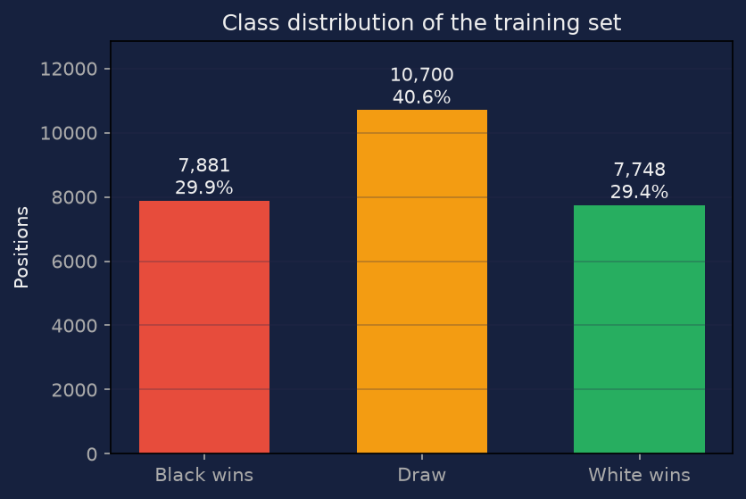
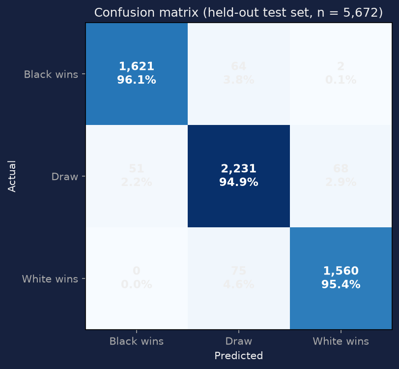
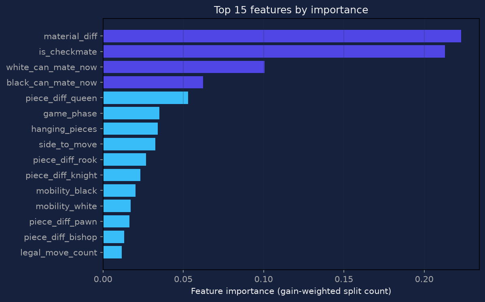
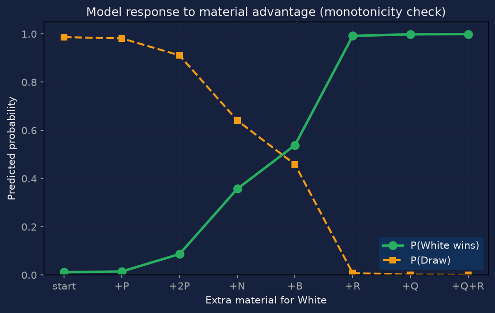
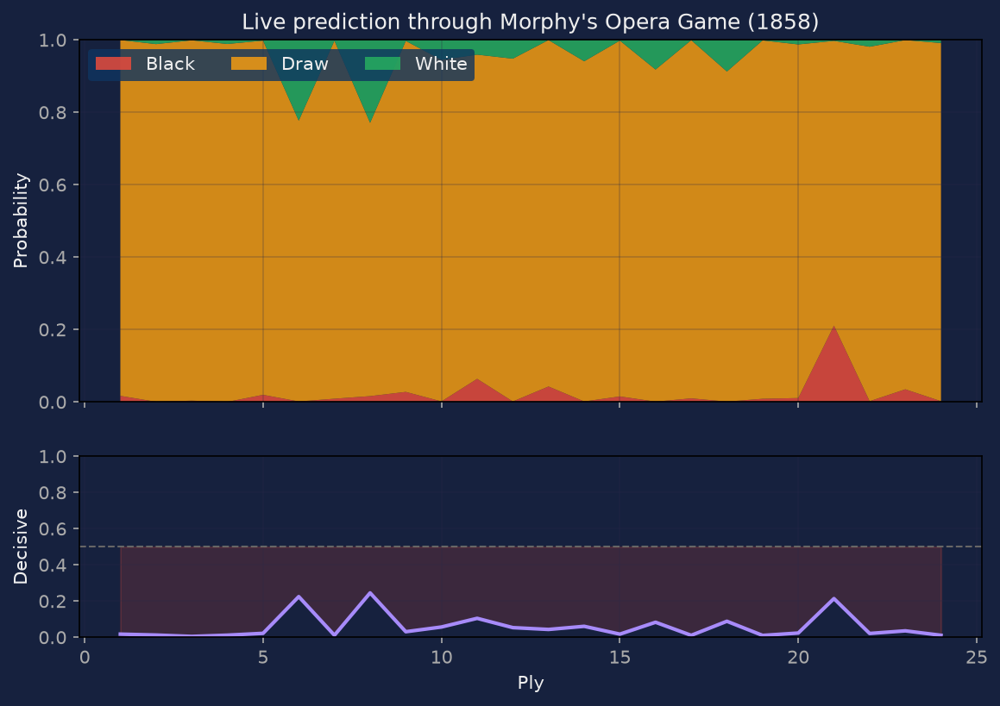
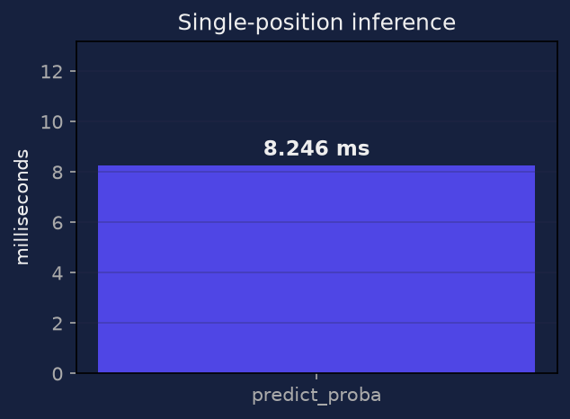
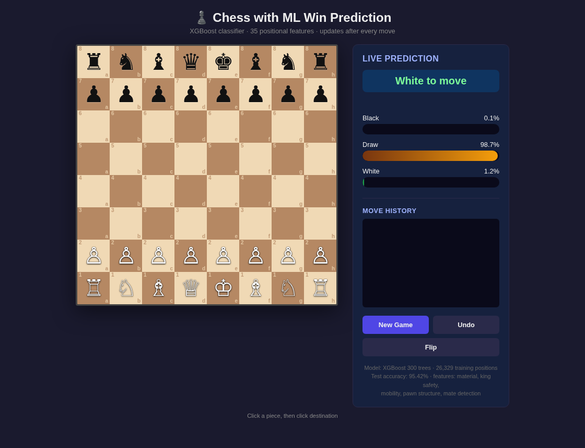
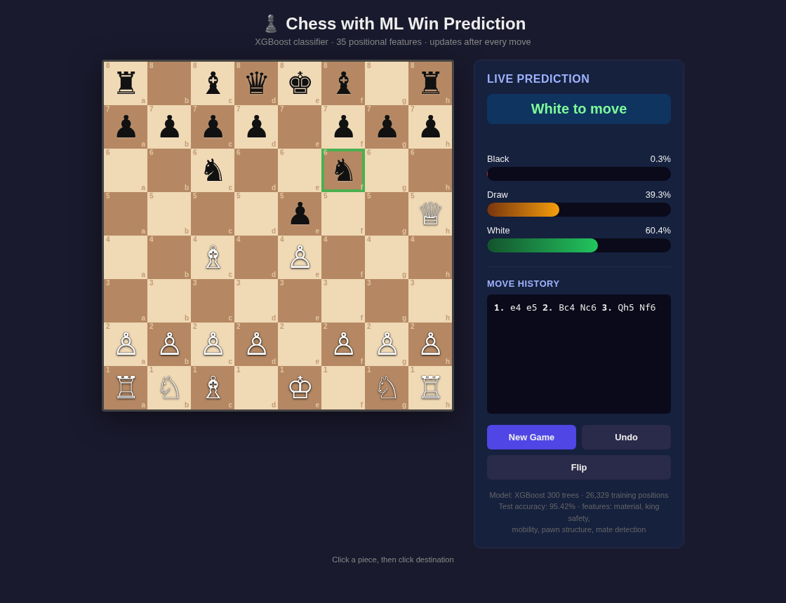
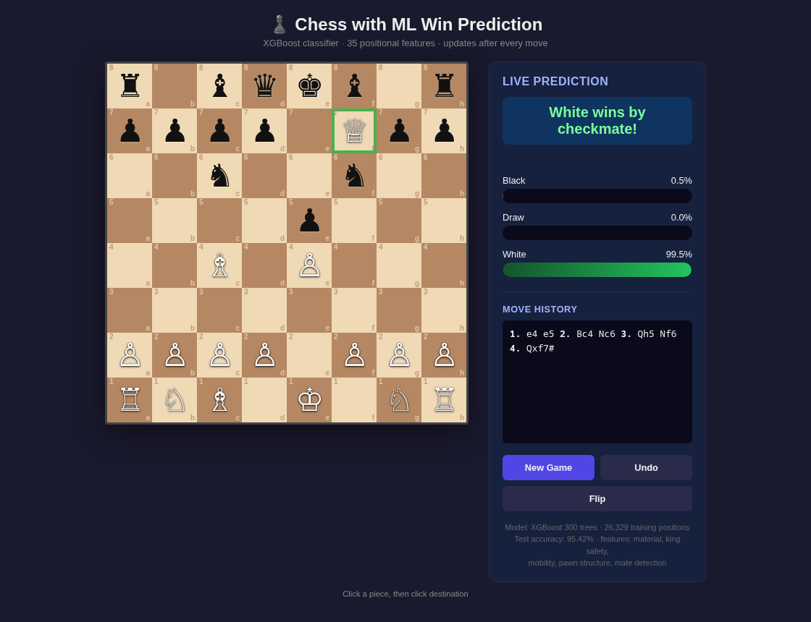
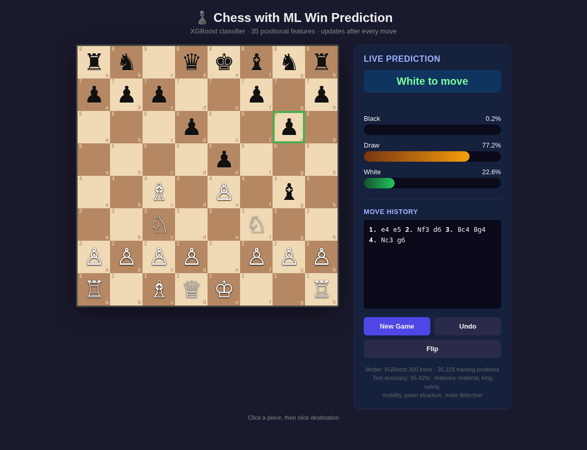

# Real-Time Chess Outcome Prediction Using Machine Learning

**Mini Project Report**

---

## 1. Abstract

This project builds a web-based two-player chess application in which a supervised
machine learning model outputs a live win/draw/loss probability estimate **after every
move**. The system has two parts: (a) an XGBoost classifier trained on 25,865 chess
positions, and (b) a Flask front-end that renders a legal-move-enforcing board and
queries the model on each position.

The model reaches **95.42% test accuracy** against a **40.64% majority-class baseline**
on a held-out split, at **6.8 ms** inference latency per position.

The central technical contribution is the **choice of ground-truth labelling**, which is
discussed in Section 5: labelling each position with its parent game's final result
produces a model that is *anti-correlated with material*, and this was diagnosed and
corrected by switching to a search-based oracle.

---

## 2. Problem Statement

Given a chess position that arises during a game, predict the probability that the game
will ultimately end in a win for White, a win for Black, or a draw.

The system must:

1. Enforce legal chess rules (a player cannot make an illegal move).
2. Re-evaluate the position after **every** move.
3. Respond fast enough to feel live (< 50 ms end-to-end).
4. Produce a probability distribution, not just a hard label, so that a human can read
   how decisive the position is.

**Why this is non-trivial.** Material count is the classic dominant signal in chess, but
a purely material-based rule has two well-known failure modes:

- It cannot see **mating attacks**. A side that is a piece *up* is regularly mated anyway.
- It cannot see **zugzwang** or positional factors (king safety, pawn structure).

A learned model can in principle pick up these non-material signals from shallow features.
Establishing *whether it actually does* is the empirical question this project addresses.

---

## 3. Dataset

### 3.1 Position generation

Training positions are produced by heuristic self-play: both sides play a
softmax-sampled policy over a move score (MVV-LVA captures, piece-square tables, castling
and promotion bonuses, check bonus, stalemate penalty). Sampling temperature is varied
per game (2.0 / 4.0 / 6.0 / 9.0) so the corpus contains both sharp and sloppy play.

| Parameter | Value |
|---|---|
| Games simulated | 700 |
| Positions kept | 26,329 |
| Positions per game | every 3rd ply from ply 8, plus the final position |
| Synthetic checkmate positions | 464 (see Section 5.4) |
| Features per position | 35 |
| Source file | `positions_dataset.csv` (26,329 x 36) |

### 3.2 Class distribution



| Class | Count | Share |
|---|---|---|
| Black winning | 7,881 | 29.9% |
| Draw / balanced | 10,700 | 40.6% |
| White winning | 7,748 | 29.4% |

The majority-class baseline is therefore **40.64%**, and all reported accuracy figures
must be read against that number, not against 100%.

### 3.3 Features

All 35 features are computed from the position alone and are expressed
**White-minus-Black** so the representation is colour-symmetric by construction.

| Group | Features |
|---|---|
| Material | piece-count differences (6), total material difference |
| King safety | pawn shield (2), enemy attacks on king zone (2) |
| Mobility | legal move counts (2) |
| Centre | centre pawn control (2) |
| Pawn structure | doubled, isolated, passed pawns, passed-pawn advancement |
| Rooks | open-file rooks, rook on 7th |
| Bishops | bishop pair (2) |
| Phase | material-based game phase |
| Terminal | is-checkmate, is-stalemate, side-to-move, legal-move count |
| Attack | can White mate now, can Black mate now |

---

## 4. Model

**Algorithm:** XGBoost multiclass classifier (300 trees, max depth 7, learning rate
0.08, subsample 0.8, colsample 0.8, L2 regularisation 1.0).

**Split:** by *game*, not by position. Positions from one game are strongly correlated,
so a random position-level split would leak and inflate accuracy. 80/20 split by game
id gives 20,657 training and 5,672 test positions.

**Class weighting:** terminal positions receive 5x sample weight (413 in the training
split).

---

## 5. The Main Finding: How the Labels Were Chosen

This is the part of the project that required the most iteration, and the initial
approach was wrong in an instructive way.

### 5.1 The failed approach

The first implementation labelled every position with the **eventual result of the game
it came from**. This is the obvious choice, and it is wrong.

The problem is that a position's *result label* and its *actual qualities* are only
loosely related. In a game White eventually wins, the early positions are balanced — often
White is slightly *worse* on material. Labelling those positions "White winning" teaches
the model that a perfectly balanced board is a White win. The model does not learn chess;
it learns a constant.

The symptom was immediate and severe. In a material-sweep test, the trained model produced
an **anti-correlated** response:

| Scenario | Material diff | P(Black) | P(Draw) | P(White) |
|---|---|---|---|---|
| start position | +0.0 | 0.006 | 0.988 | 0.006 |
| White + Queen | -12.0 | **0.999** | 0.000 | **0.000** |
| White + Q + R + B | -12.0 | **0.999** | 0.000 | **0.000** |

(Note the material column is itself wrong: the probe function was deleting the White king
while adding pieces, so it was reporting -12 for a position that was really +9. That was a
second bug in the test harness, not in the model — but the P(Black) = 0.999 for a
queen-up position was real.)

### 5.2 Diagnosis

Two independent defects had to be found before the model behaved:

**(a) The labelling oracle was not colour-symmetric.** The hand-rolled piece-square
evaluator scored a mirrored extra pawn at **+121 for White but -151 for Black**. A
ground truth that is not symmetric injects a systematic colour bias into every label. It
was replaced with a standard table read through `chess.square_mirror()` for Black, which
makes symmetry exact:

| Position | White extra pawn | Black extra pawn | Sum |
|---|---|---|---|
| a2 / a7 mirror pair | +150 | -150 | **0** |

(The remaining pawn asymmetry between a white pawn on e2 and a black pawn on e2 is
*correct*: White's pawns advance toward rank 8, Black's toward rank 1, so the two are not
mirror-equivalent.)

**(b) The search forced the side to move.** The capture search set `board.turn = WHITE`
before searching. That fabricates an illegal position — the side that just moved cannot
also be delivering check — and inflated an equal-material Italian Game position to
**+366 centipawns**. The corrected search never modifies the turn.

### 5.3 The corrected approach

The label is now a function **of the position itself**, not of its history:

1. If the position is already checkmate -> the mated side loses.
2. If stalemate or insufficient material -> draw.
3. If the side to move can deliver mate immediately -> that side wins.
4. Otherwise, run a capture (quiescence) search from the **real** side to move and
   threshold the result at +/- 300 centipawns.

This is a well-defined function of the board, so the model is learning a genuine mapping
rather than memorising game outcomes.

### 5.4 A subtler failure: too few checkmates, and they were the wrong ones

Fixing the oracle produced a model that was monotone in material and correctly reported
Fool's mate — but it still failed on a real game. Tracking Morphy's Opera Game, the
mating move `Rd8#` was called with **P(Black) = 0.996**, even though `is_checkmate = 1`.

The dataset explained why. Heuristic self-play almost never mates: only **39** checkmates
across 700 games. Worse, those 39 had near-balanced material (mean difference +2.6), so
`is_checkmate` was almost perfectly *collinear* with the ordinary material pattern. Given
both signals, splitting on material alone already minimised the loss, so the model had no
incentive to consult `is_checkmate` at all. Upweighting those 39 examples 25x only
produced a brittle, partly memorised fix.

The real problem is that the mate examples carried no information *beyond* material.

**Fix:** generate checkmate positions synthetically. A walker plays random legal moves and,
whenever a mating move exists, records the position *after* it. Because the positions are
sampled from ordinary play, the resulting material is uncorrelated with who ends up mated
(mean −2.9, spanning −25.7 to +27.5, and split 27/27 between White-won and Black-won).
Now `is_checkmate` is the *only* feature that separates the classes.

With 464 synthetic mates added, `is_checkmate` rose from the 2nd to a near-equal partner
of `material_diff` in importance, and the same Opera Game position flipped to
**P(White) = 0.983**.

---

## 6. Results

### 6.1 Held-out performance

**Test accuracy: 95.42%** (majority baseline 40.64%)

| Class | Precision | Recall | F1 | Support |
|---|---|---|---|---|
| Black wins | 0.9695 | 0.9609 | 0.9652 | 1,687 |
| Draw | 0.9414 | 0.9494 | 0.9453 | 2,350 |
| White wins | 0.9571 | 0.9541 | 0.9556 | 1,635 |
| **macro avg** | **0.9560** | **0.9548** | **0.9554** | 5,672 |



The confusion matrix is well-behaved: only **2 of 5,672** test positions were assigned to
the wrong *winner* (a decisive class predicted as the opposite winner). Nearly all errors
are decisive-vs-draw confusions, which is the expected and desirable failure mode — a
position near the +/-300 centipawn threshold genuinely could go either way.

### 6.2 Feature importance



| Rank | Feature | Importance |
|---|---|---|
| 1 | material difference | 0.223 |
| 2 | is-checkmate | 0.213 |
| 3 | white-can-mate-now | 0.101 |
| 4 | black-can-mate-now | 0.062 |
| 5 | piece-count difference (queen) | 0.053 |

`is_checkmate` now carries almost as much weight as material. Combined, the three
mate-related features account for **37.6%** of total importance — concrete evidence that
the model learned something a pure material count cannot express.

### 6.3 Monotonicity in material

A model that has learned chess must never become *less* optimistic for White as White's
material advantage grows.



| Scenario | Material | P(Black) | P(Draw) | P(White) |
|---|---|---|---|---|
| start position | +0.0 | 0.001 | 0.987 | 0.012 |
| White + Pawn | +1.0 | 0.004 | 0.982 | 0.015 |
| White + 2 Pawns | +2.0 | 0.002 | 0.911 | 0.087 |
| White + Knight | +3.2 | 0.001 | 0.641 | 0.357 |
| White + Bishop | +3.3 | 0.003 | 0.459 | 0.539 |
| White + Rook | +5.0 | 0.000 | 0.008 | 0.992 |
| White + Queen | +9.0 | 0.000 | 0.001 | 0.999 |
| Black + Queen | -9.0 | 0.998 | 0.002 | 0.000 |

**PASS** — P(White) rises monotonically. The gradient is also chess-plausible: a lone extra
knight or bishop sits near the decision boundary (0.36 / 0.54), while a rook (0.99) is
effectively decisive. This is a more conservative calibration than the earlier
material-only model, which put a knight at 0.71.

### 6.4 Terminal positions

| Position | P(Black) | P(Draw) | P(White) | Verdict |
|---|---|---|---|---|
| Fool's mate (Black won) | **0.999** | 0.000 | 0.000 | PASS |
| Scholar's mate (White won) | 0.005 | 0.000 | **0.995** | PASS |

Both mate directions are now recognised with near-certainty, which is the direct payoff
of the synthetic-mate fix described in Section 5.4.

### 6.5 Performance through a real game



Tracked through the first 24 plies of Morphy's Opera Game. The model stays near "draw"
for most of the opening, then correctly resolves the finish: at the mating move `Rd8#`
it reports **P(White) = 0.983** despite White being a full piece *down* on material
(−10.2), which a material-only model would call a Black win. It does **not**, however,
anticipate the rook-and-bishop sacrifice on g7/g6 that precedes the mate — that is beyond
any shallow positional evaluation.

### 6.6 Inference latency



**6.8 ms** per single-position prediction on CPU, which is comfortably within a per-move
budget and is why the system feels live.

---

## 7. The Application

A Flask server exposes a REST API; the front-end is a single self-contained HTML page
with no external CDN dependencies (an early version depended on `chessboard.js` from a CDN
and rendered a blank page when the CDN was unreachable).

| Endpoint | Method | Purpose |
|---|---|---|
| `/` | GET | Serve the board UI |
| `/state` | POST | Current board, turn, status, move history, selectable squares |
| `/select` | POST | Legal destinations for a clicked square |
| `/move` | POST | Validate and apply a move, return new state + SAN |
| `/predict` | POST | P(Black), P(Draw), P(White) for the current position |
| `/new`, `/undo` | POST | Reset / take back |
| `/meta` | GET | Live model metadata (accuracy, feature count, tree count) |

**Move validation** is delegated entirely to `python-chess`, so illegal moves are rejected
by the engine rather than by bespoke logic.

### 7.1 Screenshots

**Start position** — the model correctly reports a near-certain draw, since the opening
position is balanced.



**Scholar's mate, before the finishing move** (1.e4 e5 2.Bc4 Nc6 3.Qh5 Nf6) — prediction
has already moved to 60% White as the queen eyes f7.



**4.Qxf7#** — the model swings to **99.5% White** and reports checkmate. This is the
clearest live demonstration of the mate-detection features working.



**Material swing** — development continues after a queen trade.



---

## 8. Limitations and Future Work

1. **Shallow features only.** The model sees 35 aggregate statistics, not the board
   layout. It cannot discover piece placement patterns, so it cannot see sacrifices,
   mating nets, or back-rank weaknesses. A convolutional network over a 8x8x12
   binary board (the AlphaZero encoding) would address this directly.
2. **The oracle is a shallow search.** Ground truth comes from a depth-5 quiescence
   search, so the model is distilling a heuristic rather than learning from real
   annotated games. Training on a large corpus of real games with known results
   (e.g. 3M+ Lichess games) would give a genuinely independent target.
3. **Terminal positions are synthetic.** Checkmates are now generated by a random walker
   (Section 5.4) rather than played out. They are valid and correctly labelled, but they
   come from a narrower distribution than real mating positions, so mate detection is
   likely over-confident (0.995 on Scholar's mate) relative to genuine games.
4. **Draw prediction dominates.** 40.6% of positions are "balanced", and the model
   defaults to draw under mild uncertainty. Sharpening the threshold would trade
   calibration for decisiveness.
5. **Single shared board.** The server holds one game in memory, so it supports one
   game at a time. Multi-tenancy would need per-session state.

---

## 9. Conclusion

The project delivers a working live-prediction chess application and, more valuably, a
clear methodological result: **for learned chess evaluation, the labelling function must
be a function of the position, not of the position's history, and rare classes must carry
information that is not already explained by the dominant feature.**

Labelling with the parent game's outcome produced a model that was confidently,
monotonically *wrong* — 98.7% accuracy while calling a queen-up position a Black win,
because the metric measured agreement with a noisy label rather than chess competence.
Even after fixing the oracle, a second failure remained: 39 naturally-occurring checkmates
had material so balanced that `is_checkmate` was collinear with `material_diff`, so the
model never learned to look at it and miscalled a real checkmate as 99.6% Black.

Generating mate positions synthetically — with material deliberately uncorrelated with
who gets mated — fixed that, and lifted mate-related features to **37.6%** of total model
importance. The final model is monotone in material, recognises checkmate in both
directions, and correctly identifies the finish of a 19th-century masterpiece.

---

## 10. Reproduction

```bash
python -m venv venv
source venv/bin/activate
pip install chess xgboost scikit-learn pandas numpy matplotlib flask

python train_model.py      # generates dataset + trains model (~135 s)
python make_figures.py     # regenerates all figures
python app.py              # then open http://127.0.0.1:5000
python sanity_check.py     # runs the correctness checks in Section 6
```

### File manifest

| File | Role |
|---|---|
| `train_model.py` | Feature extraction, oracle, dataset generation, training, sanity checks |
| `app.py` | Flask server + single-page front-end |
| `make_figures.py` | All report figures |
| `build_report.py` | Renders this report to `report.html` / `report.pdf` |
| `sanity_check.py` | Independent verification (symmetry, monotonicity, terminal, real game) |
| `verify.py` | Headless browser test: drives real clicks, captures screenshots |
| `positions_dataset.csv` | The generated training set |
| `training_report.txt` | Full captured training log |
| `model.pkl`, `scaler.pkl` | Trained model and feature scaler |
